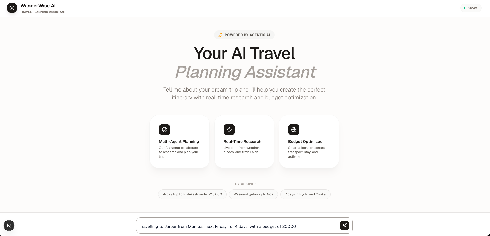
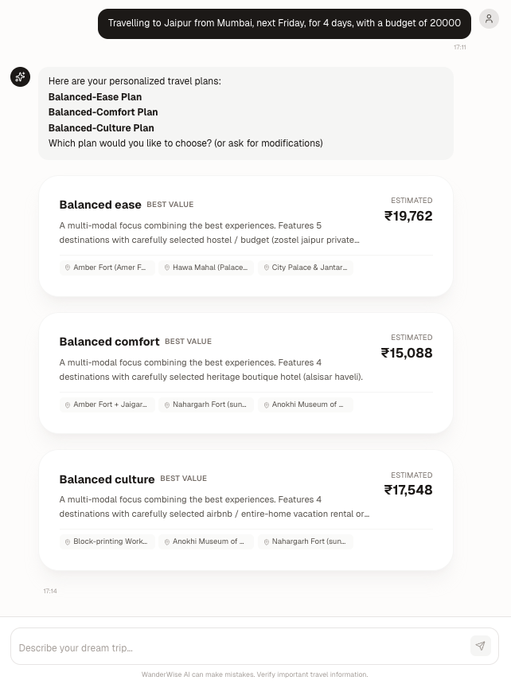
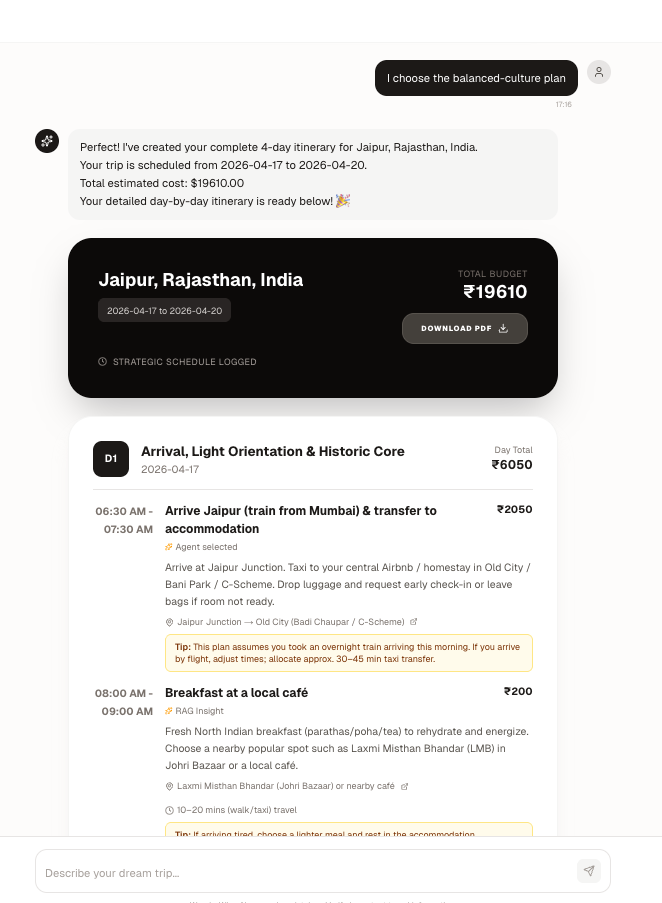
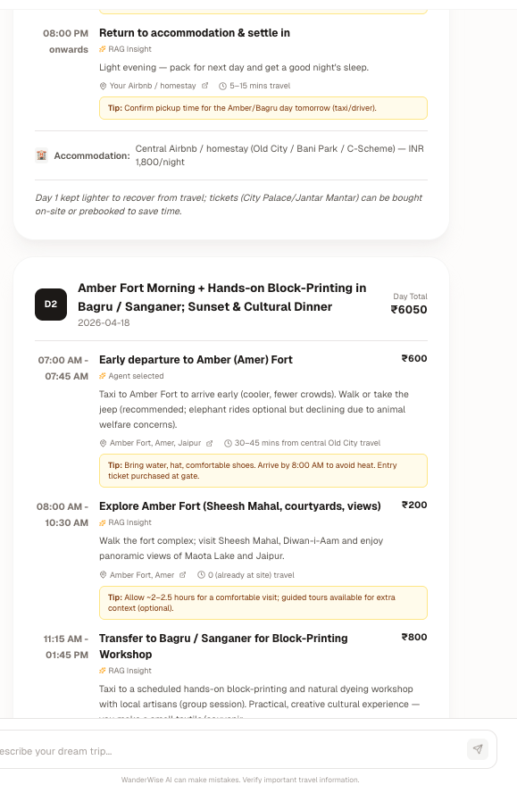
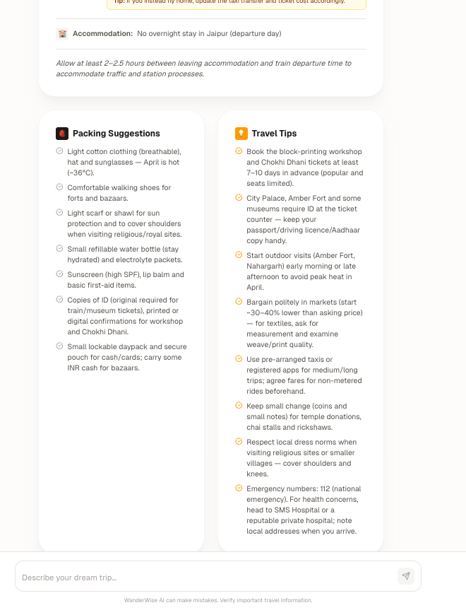

# WanderWise AI

> Autonomous travel planning for the modern nomad

WanderWise AI is an AI-powered web application that helps users plan their travel adventures with intelligent recommendations and personalized itineraries. Describe your trip in plain language and get a fully researched, day-by-day itinerary with real-time data on places, weather, transport, and stays.

---

## Demo

### 1. Landing Page — describe your trip in plain language



### 2. AI presents multiple plan variants with cost estimates



### 3. Detailed day-by-day itinerary generated after plan selection



### 4. Full schedule with timings, costs, and agent insights



### 5. Packing suggestions and contextual travel tips



---

## How It Works

WanderWise AI uses a **multi-agent LangGraph pipeline** split into a Main Graph and a Research Subgraph that run in coordination.

### High-level flow

```
User query
    │
    ▼
[Travel Agent] ── extracts destination, dates, budget, travel vibe
    │
    ├─ missing inputs? ──► ask user, wait
    │
    ▼
[Research Subgraph] ── parallel fan-out across 4 specialist agents
    ├── Places Agent    → attractions, activities, local experiences (Tavily)
    ├── Weather Agent   → conditions, best times, seasonal trends (Tavily)
    ├── Transport Agent → routes, options, cost analysis (Tavily)
    └── Stay Agent      → accommodation options, budget matching (Tavily)
    │
    ▼
[Synthesizer] ── combines research into 2–3 plan variants
    │
    ▼
[Present Plans] ── user picks a plan (or requests modifications)
    │
    ▼
[Itinerary Planner] ── builds complete day-by-day schedule with tips & costs
    │
    ▼
Final itinerary delivered to user
```

### Key design decisions

| Concern | Approach |
|---|---|
| **Parallel research** | Places, Weather, Transport and Stay agents run concurrently via LangGraph fan-out, minimising latency |
| **Delta re-execution** | When a user modifies a parameter (e.g. changes dates), only the affected research agents re-run — not all four |
| **Plan variants** | The Synthesizer always produces 2–3 distinct variants (e.g. budget vs comfort vs cultural focus) so the user has real choice |
| **Human-in-the-loop** | The graph pauses at two checkpoints: missing input collection and plan selection — keeping the user in control |
| **Streaming UI** | The frontend streams agent responses in real-time so users see progress rather than waiting for a final dump |

### Agent responsibilities

| Agent | Role |
|---|---|
| **Travel Agent** | Parameter extraction, intent classification, input validation |
| **Coordinator** | Delta detection, decides which research agents need to re-run |
| **Places Agent** | Finds attractions, activities and local experiences |
| **Weather Agent** | Fetches conditions, best travel windows and weather trends |
| **Transport Agent** | Researches routes, transport modes and estimated costs |
| **Stay Agent** | Matches accommodation options to budget and travel vibe |
| **Synthesizer** | Merges all research into coherent plan variants |
| **Itinerary Planner** | Produces the final hour-by-hour schedule with costs and tips |

---

## Project Structure

This is a monorepo containing:

```
wanderwise-ai/
├── frontend/          # Next.js web application
├── backend/           # FastAPI server
└── README.md         # This file
```

## Technology Stack

### Frontend
- **Framework**: Next.js 16.1.6 (App Router)
- **Language**: TypeScript 5+
- **Styling**: Tailwind CSS 4
- **UI Library**: React 19.2.3

### Backend
- **Language**: Python 3.12
- **Framework**: FastAPI 0.115.6
- **Server**: Uvicorn 0.34.0
- **Validation**: Pydantic 2.10.6

## Quick Start

### Prerequisites

- Node.js 18+ and npm
- Python 3.12+
- pip

### Setup Instructions

#### 1. Frontend Setup

```bash
cd frontend
npm install
npm run dev
```

The frontend will be available at http://localhost:3000

#### 2. Backend Setup

```bash
cd backend
python3.12 -m venv venv
source venv/bin/activate  # On Windows: venv\Scripts\activate
pip install -r requirements.txt
uvicorn main:app --reload
```

The backend API will be available at http://localhost:8000

**API Documentation:**
- Swagger UI: http://localhost:8000/docs
- ReDoc: http://localhost:8000/redoc

## Development

Both frontend and backend support hot-reloading during development:

- **Frontend**: Changes to TypeScript/React files will automatically refresh
- **Backend**: Changes to Python files will automatically restart the server (when using `--reload`)

## Project Status

**MVP Complete** — The full agentic planning pipeline is working end-to-end: query intake, parallel research, plan synthesis, plan selection, and day-by-day itinerary generation with streaming UI.

## Documentation

For detailed information about each component:

- [Frontend Documentation](./frontend/README.md)
- [Backend Documentation](./backend/README.md)

## License

TBD

## Contributing

TBD
