# WanderWise AI - Mermaid Architecture Diagrams

This document contains Mermaid diagrams for visualizing the WanderWise AI architecture and flows.

## Table of Contents
1. [Main Graph Flow](#main-graph-flow)
2. [Research Subgraph Flow](#research-subgraph-flow)
3. [Complete User Journey](#complete-user-journey)
4. [State Transitions](#state-transitions)
5. [Agent Architecture](#agent-architecture)
6. [Proposed Enhanced Architecture](#proposed-enhanced-architecture)

---

## Main Graph Flow

### Current Implementation

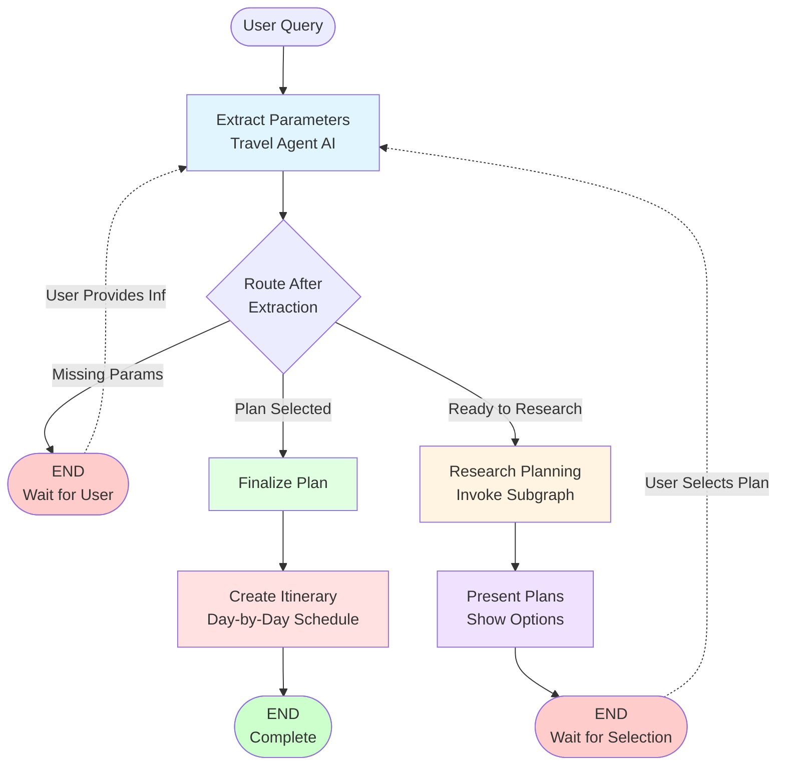

### Detailed Node Flow

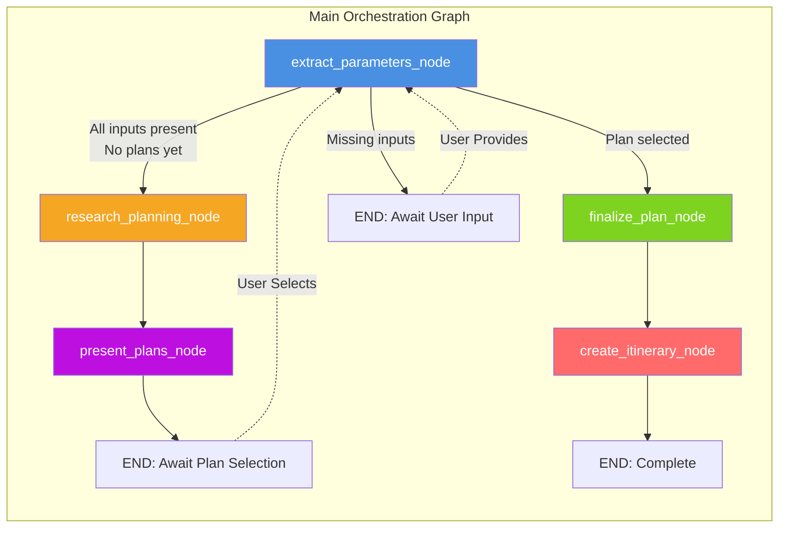

---

## Research Subgraph Flow

### Current Implementation

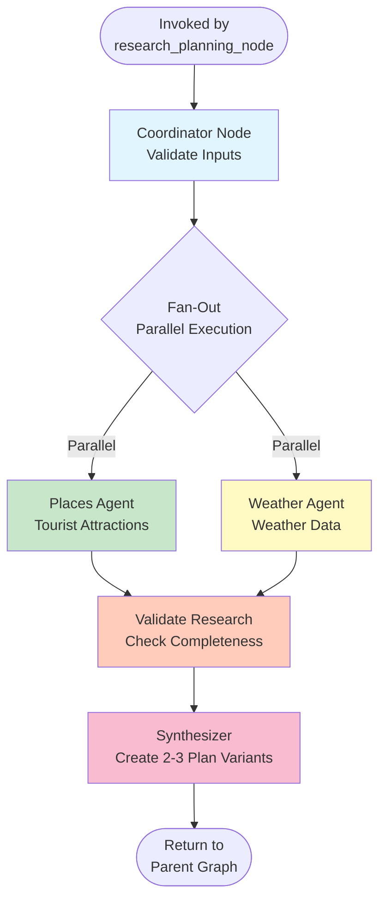

### With Future Agents

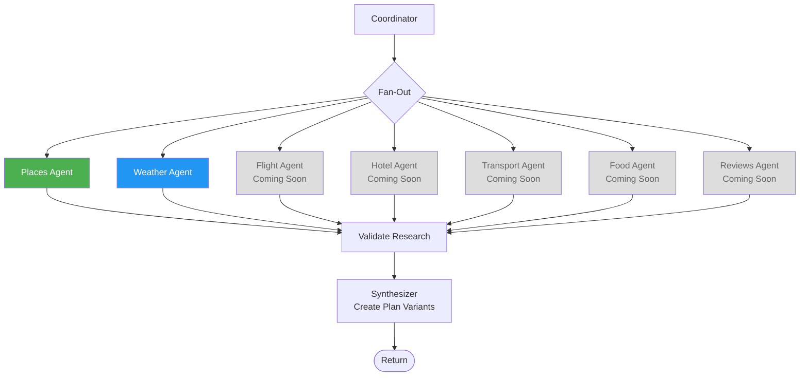

---

## Complete User Journey

### End-to-End Flow

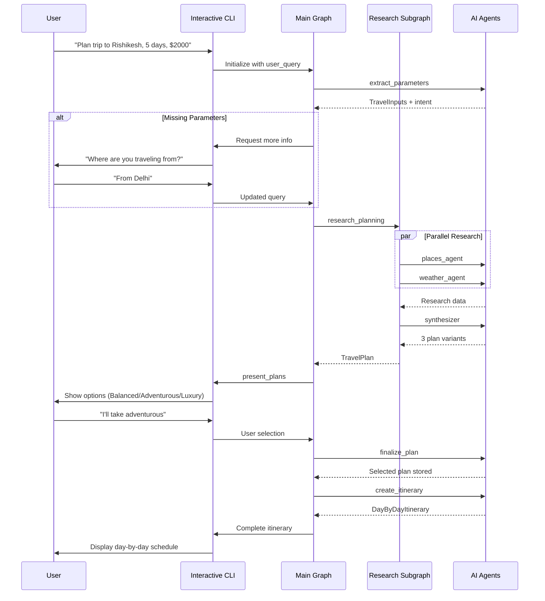

### Routing Decision Flow

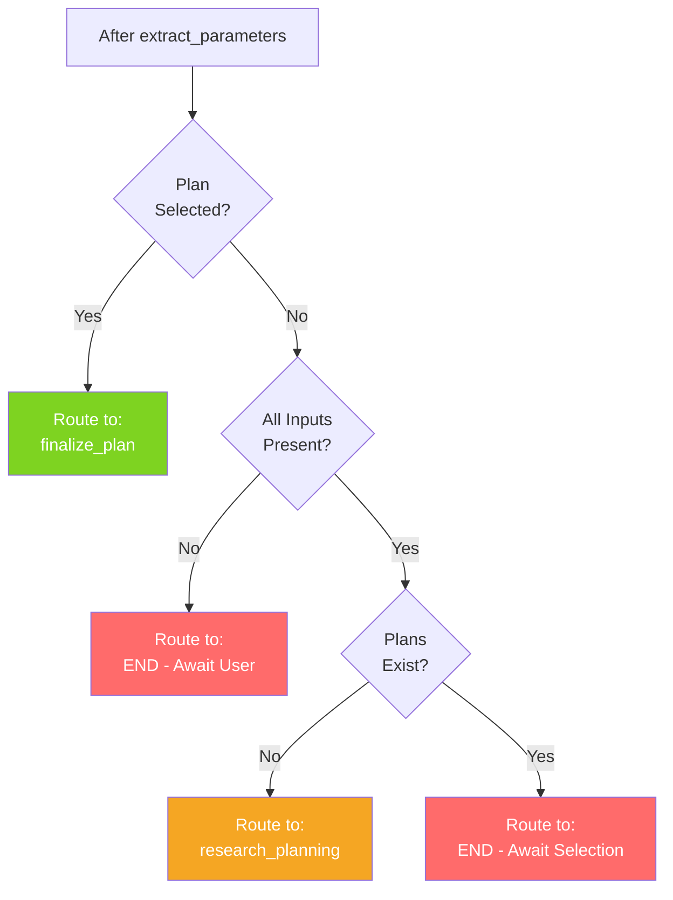

---

## State Transitions

### State Lifecycle

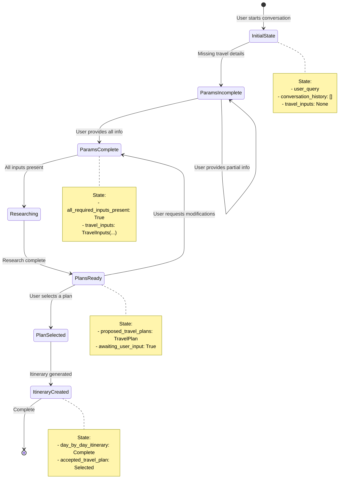

### State Data Flow

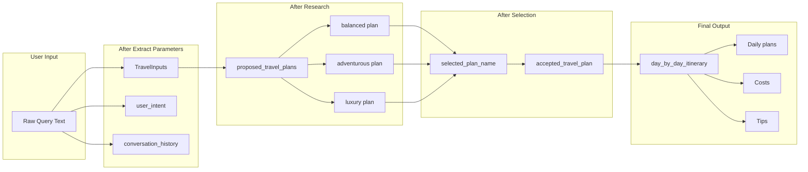

---

## Agent Architecture

### Current Agent Ecosystem

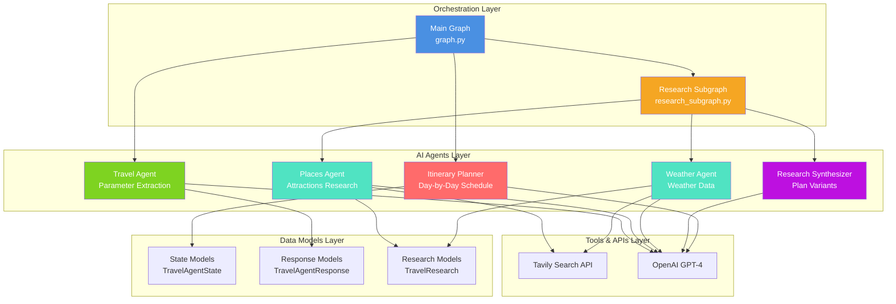

### Agent Responsibility Matrix

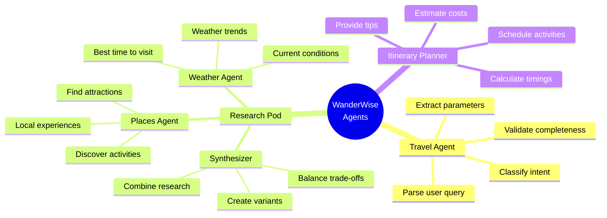

---

## Proposed Enhanced Architecture

### With All Planned Agents

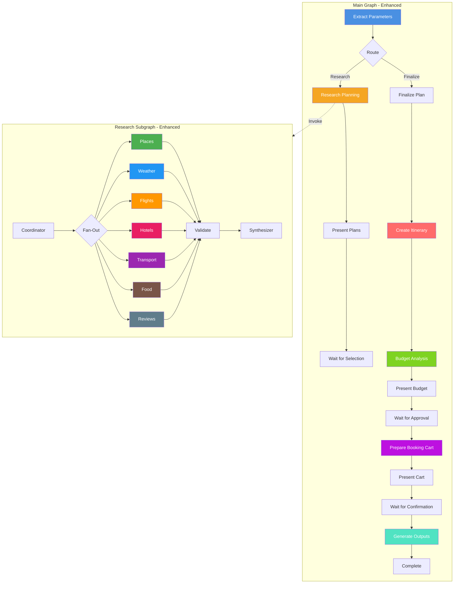

### Multiple Approval Checkpoints

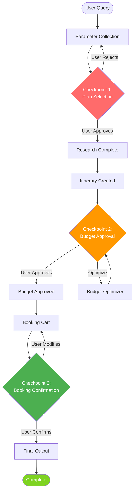

---

## System Architecture Overview

### High-Level Components

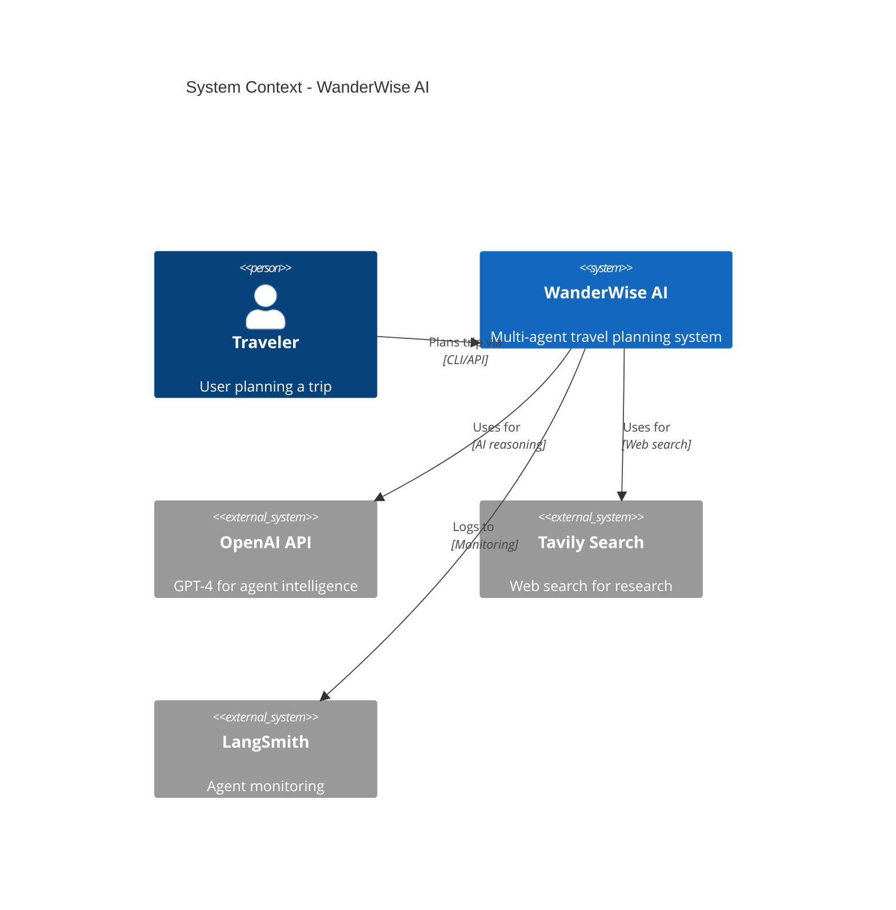

### Container Diagram

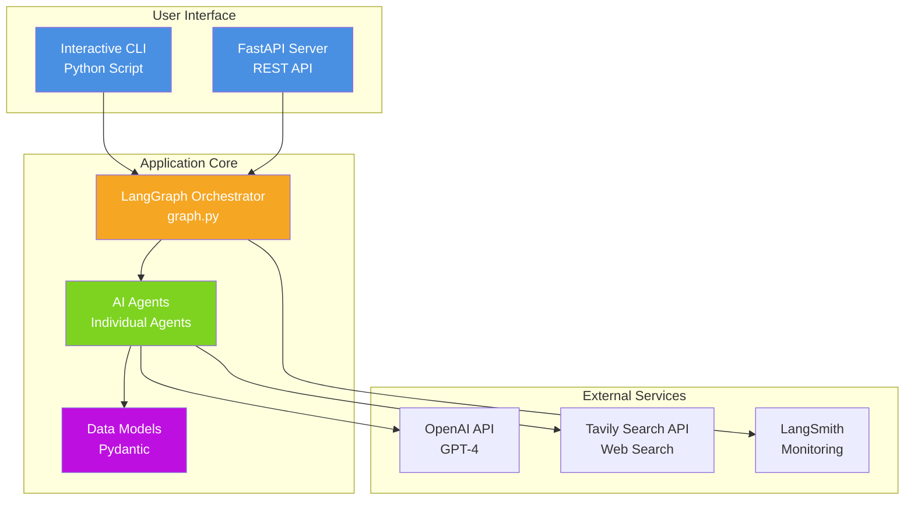

---

## Data Flow Diagram

### Information Transformation Pipeline

```mermaid
graph LR
    A[User Text<br/>Raw Query] -->|Travel Agent| B[Structured Data<br/>TravelInputs]
    
    B -->|Research Agents| C[Research Data<br/>Places, Weather, etc.]
    
    C -->|Synthesizer| D[Plan Variants<br/>TravelPlan]
    
    D -->|User Selection| E[Selected Plan<br/>TravelResearch]
    
    E -->|Itinerary Planner| F[Final Itinerary<br/>DayByDayItinerary]
    
    F -->|Display| G[User Output<br/>Formatted Display]
    
    style A fill:#E3F2FD
    style B fill:#FFF3E0
    style C fill:#F3E5F5
    style D fill:#E8F5E9
    style E fill:#FCE4EC
    style F fill:#FFF9C4
    style G fill:#E0F2F1
```

---

## Performance Visualization

### Parallel Execution Speed-Up

```mermaid
gantt
    title Sequential vs Parallel Agent Execution
    dateFormat  s
    axisFormat %Ss
    
    section Sequential
    Places Agent        :a1, 0, 10s
    Weather Agent       :a2, after a1, 8s
    Flight Agent        :a3, after a2, 12s
    Hotel Agent         :a4, after a3, 10s
    
    section Parallel
    Places Agent        :b1, 0, 10s
    Weather Agent       :b2, 0, 8s
    Flight Agent        :b3, 0, 12s
    Hotel Agent         :b4, 0, 10s
```

---

## Error Handling Flow

### Retry and Fallback Strategy (Proposed)

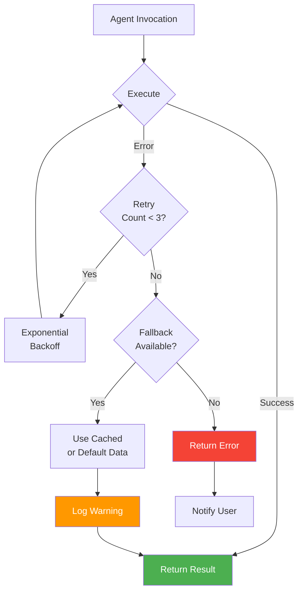

---

## Usage Instructions

### How to Use These Diagrams

1. **Copy any diagram code block** above
2. **Paste into a Mermaid editor**:
   - GitHub (supports Mermaid in markdown)
   - https://mermaid.live/
   - VS Code (with Mermaid extension)
   - Documentation sites (GitBook, etc.)

3. **Customize** colors, labels, or structure as needed

### Rendering in GitHub

GitHub automatically renders Mermaid diagrams in markdown. Simply include the code blocks as:

\`\`\`mermaid
graph TD
    A --> B
\`\`\`

### Exporting Diagrams

Using mermaid.live:
- Export as PNG/SVG for presentations
- Export as PDF for documentation
- Copy as image for embedding

---

## Contributing

To add new diagrams:
1. Follow the existing style and naming conventions
2. Use consistent colors for similar node types
3. Add descriptive titles and legends
4. Test rendering in GitHub or mermaid.live
5. Update the Table of Contents

---

**Note**: These diagrams are living documentation. Update them as the architecture evolves.
