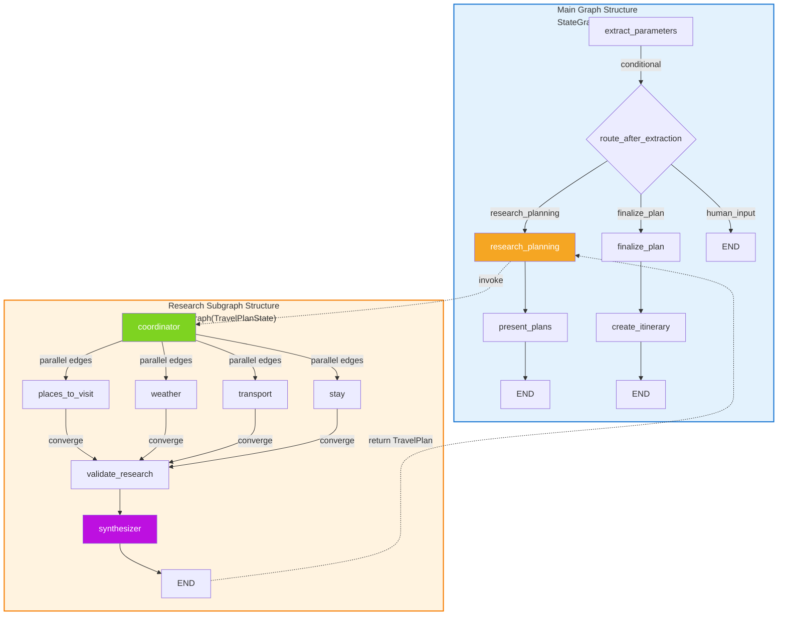
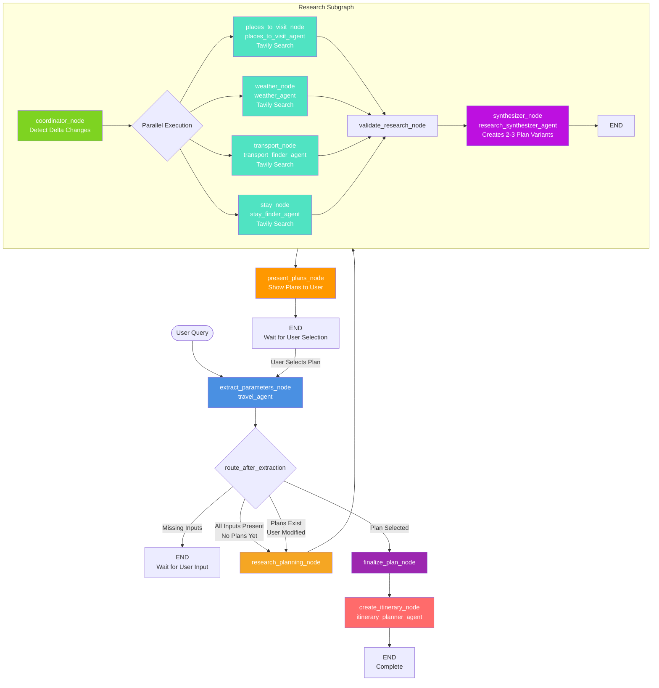
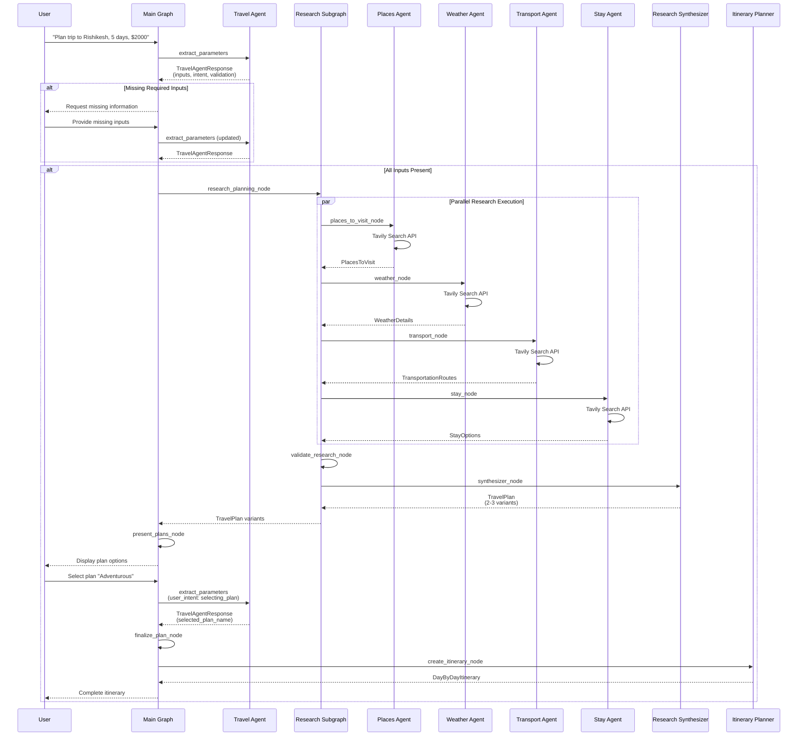
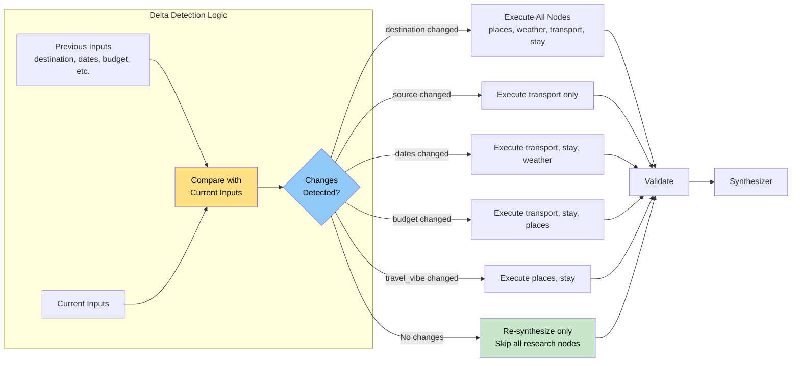
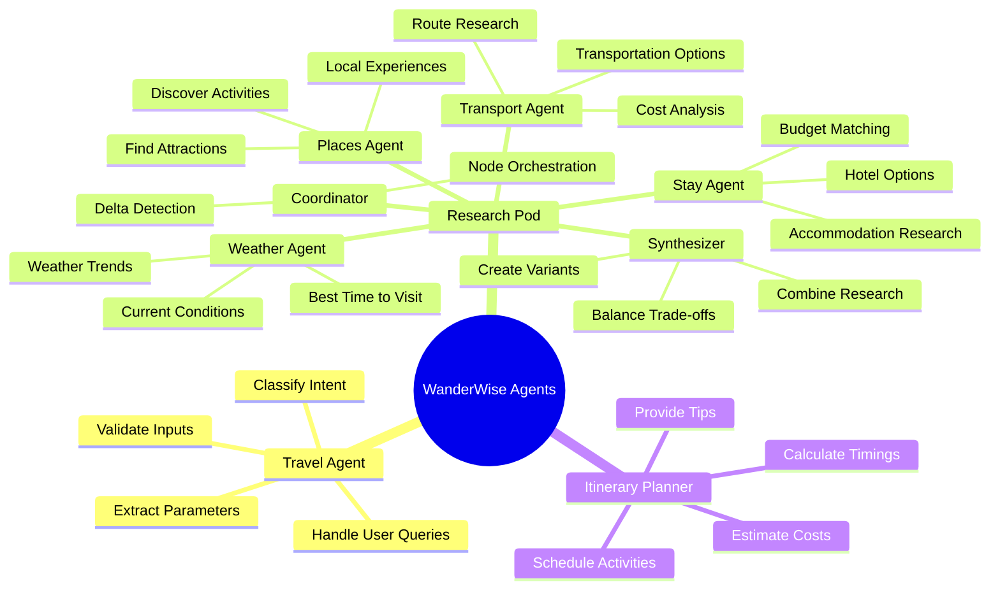

# Agent Flow Diagram

## Graph + Subgraph Architecture

```mermaid
flowchart TB
    subgraph MainGraph["Main Graph (TravelAgentState)"]
        Entry[Entry Point] --> ExtractParams[extract_parameters<br/>Node]
        
        ExtractParams --> Route{route_after_extraction<br/>Conditional Router}
        
        Route -->|Missing Inputs| End1[END]
        Route -->|All Inputs Present| ResearchPlanning[research_planning<br/>Node]
        Route -->|Plan Selected| FinalizePlan[finalize_plan<br/>Node]
        
        ResearchPlanning -.invokes.-> SubgraphInvoke[Research Subgraph]
        
        SubgraphInvoke -.returns.-> PresentPlans[present_plans<br/>Node]
        PresentPlans --> End2[END]
        
        FinalizePlan --> CreateItinerary[create_itinerary<br/>Node]
        CreateItinerary --> End3[END]
    end
    
    subgraph ResearchSubgraph["Research Subgraph (TravelPlanState)"]
        SubEntry[Entry Point] --> Coordinator[coordinator<br/>Node<br/>Delta Detection]
        
        Coordinator -->|Parallel Fan-Out| Places[places_to_visit<br/>Node]
        Coordinator -->|Parallel Fan-Out| Weather[weather<br/>Node]
        Coordinator -->|Parallel Fan-Out| Transport[transport<br/>Node]
        Coordinator -->|Parallel Fan-Out| Stay[stay<br/>Node]
        
        Places -->|Converge| Validate[validate_research<br/>Node]
        Weather -->|Converge| Validate
        Transport -->|Converge| Validate
        Stay -->|Converge| Validate
        
        Validate --> Synthesizer[synthesizer<br/>Node]
        Synthesizer --> SubEnd[END<br/>Returns TravelPlan]
    end
    
    style MainGraph fill:#E3F2FD,stroke:#1976D2,stroke-width:3px
    style ResearchSubgraph fill:#FFF3E0,stroke:#F57C00,stroke-width:3px
    style ExtractParams fill:#4A90E2,color:#fff
    style ResearchPlanning fill:#F5A623,color:#fff
    style Coordinator fill:#7ED321,color:#fff
    style Synthesizer fill:#BD10E0,color:#fff
    style FinalizePlan fill:#9C27B0,color:#fff
    style CreateItinerary fill:#FF6B6B,color:#fff
```

## Graph Structure Details

## Complete Agent Flow Sequence

## Detailed Sequence Diagram

## Delta Execution Flow (Re-optimization)

## Agent Responsibilities

